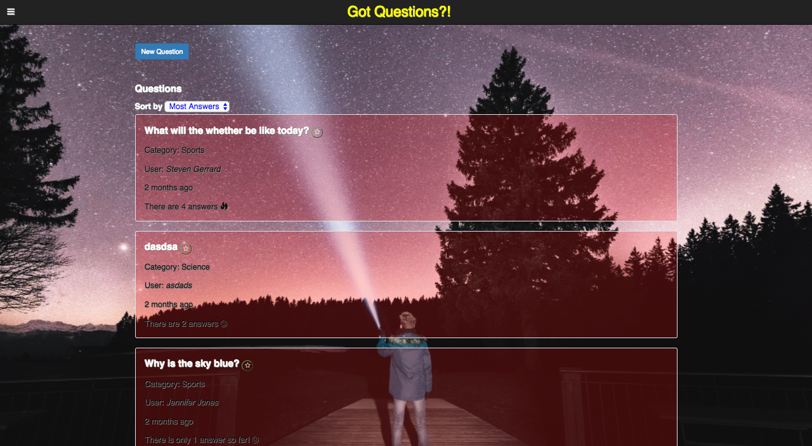
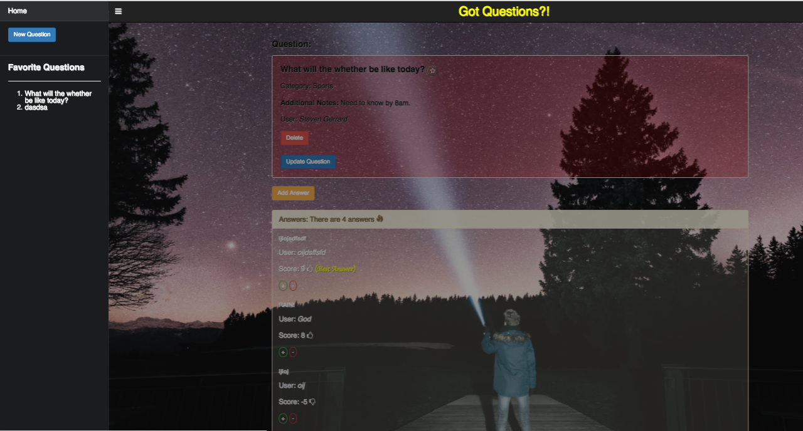

# Question and Answer Message Board

#### _This is a message board web application, where a user submits a question and other users can respond with answers. October 28, 2016_

#### By _**Stephen Burden**_

[Click here to view live](https://qa-board.pagefrontapp.com/)

## Specifications
| Behavior | Input Example | Output Example |
| --- | --- | --- |
| Take a question entry and display it back to user | What is the weather going to be like today?, Need to know by 8am, Steven Gerrard | Question: What is the weather going to be like today?, Notes: Need to know by 8am, Author: Steven Gerrard |
| Take an answer entry for a question | It's going to raining most of the day, Jurgen Klopp | Answer: It's going to raining most of the day, Author: Jurgen Klopp |
| Edit a question entry | Notes: Need to know by 8am -> Need to know by 9am | Question: What is the weather going to be like today?, Notes: Need to know by 9am, Author: Steven Gerrard |
| Store Favorite Questions | Question: What is the weather going to be like today? | Favorites: What is the weather going to be like today? |
| Upvote or Downvote Answers | UPVOTE: Answer: Raining, Score: 1 | Answer: Raining, Score: 2 |
| Sort questions by a certain Attribute | Sort by Number of Answers | What is the weather going to be like today? Answers: 5, Why is the sky blue? Answers: 2 |
| Filter questions by a certain Category | Filter by Category: Weather | Question: What is the weather going to be like today? |

## Prerequisites
You will need the following things properly installed on your computer.

* [Git](http://git-scm.com/)
* [Node.js](http://nodejs.org/) (with NPM)
* [Bower](http://bower.io/)
* [Ember CLI](http://ember-cli.com/)
* [PhantomJS](http://phantomjs.org/)

## Setup/Installation Requirements
* _In the Terminal enter the following commands:_
  * `git clone https://github.com/spburden/qa-message-board-ember`
  * `cd <PROJECT-DIRECTORY>`
  * `npm install`
  * `bower install`
  * `ember serve`
* _To view the go to http://localhost:4200 in your web browser_

## Link
https://github.com/spburden/qa-message-board-ember

## Known Bugs
_There are no known bugs with this application._

## Support and contact details
_spburden@hotmail.com_

## Technologies Used
_Ember JS, JavaScript, JQuery, Node, npm, Bower, Gulp, Sass, HTML, CSS, and Bootstrap_

### License
The MIT License (MIT)

Copyright (c) 2016 **_Stephen Burden_**
